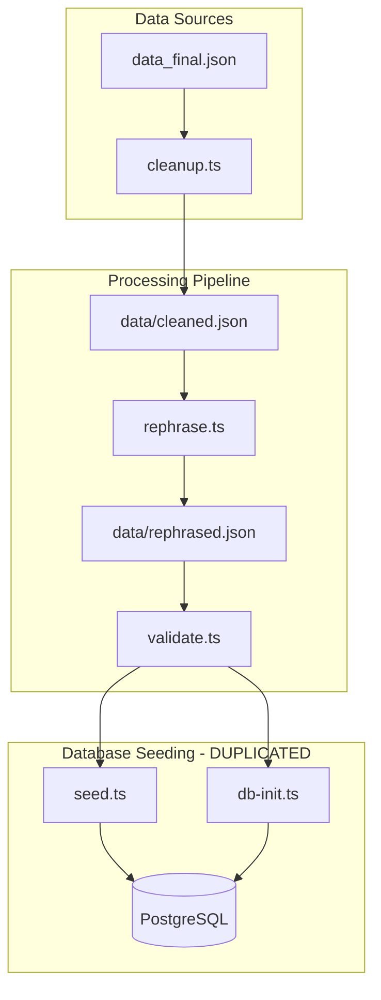
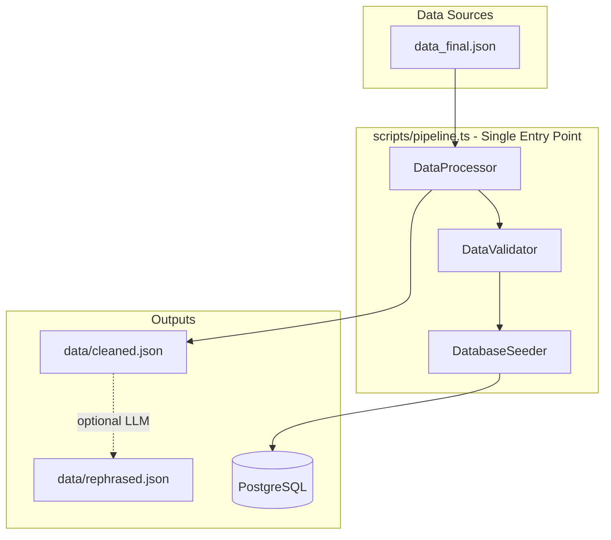

# Data Pipeline Consolidation Plan

## Current State Analysis

The current data pipeline consists of 5 separate scripts with duplicated logic spread across multiple files:




### Key Issues

1. **Duplicated seeding logic** - Both [`scripts/seed.ts`](scripts/seed.ts) and [`scripts/db-init.ts`](scripts/db-init.ts) contain nearly identical database seeding code (~300 lines duplicated)
2. **Fragmented entry points** - Users must run 4+ commands for a full deployment:

- `npm run data:cleanup`
- `npm run data:rephrase` (optional, requires API key)
- `npm run data:validate`
- `npm run data:seed` OR `npm run db:init`

3. **Inconsistent migration strategy** - Uses `drizzle-kit push` in db-init.ts but has migration files in `server/db/migrations/`
4. **No idempotent single command** - Current `start` script runs `db:init` which skips seeding if data exists, but doesn't handle data updates

---

## Proposed Architecture



---

## Implementation Plan

### Phase 1: Create Shared Seeding Module

Extract the common seeding logic from both `seed.ts` and `db-init.ts` into a shared module:**Create [`scripts/lib/seeder.ts`](scripts/lib/seeder.ts)**

- Export reusable functions: `seedLocales()`, `seedRegions()`, `seedCategories()`, `seedLessons()`, `seedAssets()`, `seedQuestions()`
- Export a main `seedDatabase(options)` function with configurable behavior

### Phase 2: Create Unified Pipeline Script

**Create [`scripts/pipeline.ts`](scripts/pipeline.ts)**

- Single orchestrator that handles all steps in sequence
- Configurable via CLI flags:
- `--skip-cleanup` - Skip cleanup if cleaned.json exists
- `--skip-rephrase` - Skip LLM rephrasing (default if no API key)
- `--skip-validate` - Skip validation
- `--skip-seed` - Skip database seeding
- `--force` - Re-run all steps even if outputs exist
- `--fresh-db` - Wipe and reseed database

### Phase 3: Simplify Existing Scripts

- **`db-init.ts`** - Refactor to use shared seeder module, keep as lightweight deployment init
- **`seed.ts`** - Refactor to use shared seeder module, keep for manual re-seeding
- **`cleanup.ts`, `rephrase.ts`, `validate.ts`** - Keep as standalone scripts, export core functions for pipeline use

### Phase 4: Update package.json Scripts

```json
{
  "scripts": {
    "deploy": "tsx scripts/pipeline.ts",
    "deploy:fresh": "tsx scripts/pipeline.ts --force --fresh-db",
    "data:pipeline": "npm run deploy -- --skip-seed"
  }
}
```

---

## New Deployment Workflow

For a new environment deployment:

```bash
# Single command handles everything
DATABASE_URL=... npm run deploy
```

This will:

1. Check if `data/cleaned.json` exists, run cleanup if not
2. Skip rephrasing if `ANTHROPIC_API_KEY` not set (or use existing rephrased.json)
3. Validate the data
4. Push schema if database is empty
5. Seed database if empty, or apply data fixes if already seeded

---

## Files to Modify

| File | Change ||------|--------|| `scripts/lib/seeder.ts` | **NEW** - Shared seeding module || `scripts/pipeline.ts` | **NEW** - Unified pipeline orchestrator || `scripts/db-init.ts` | Refactor to use shared seeder || `scripts/seed.ts` | Refactor to use shared seeder || `scripts/cleanup.ts` | Export core functions || `scripts/rephrase.ts` | Export core functions || `scripts/validate.ts` | Export core functions || `package.json` | Add new `deploy` scripts |---

## Environment Variables Summary

For new deployments, only these are needed:| Variable | Required | Description ||----------|----------|-------------|| `DATABASE_URL` | Yes | PostgreSQL connection string |